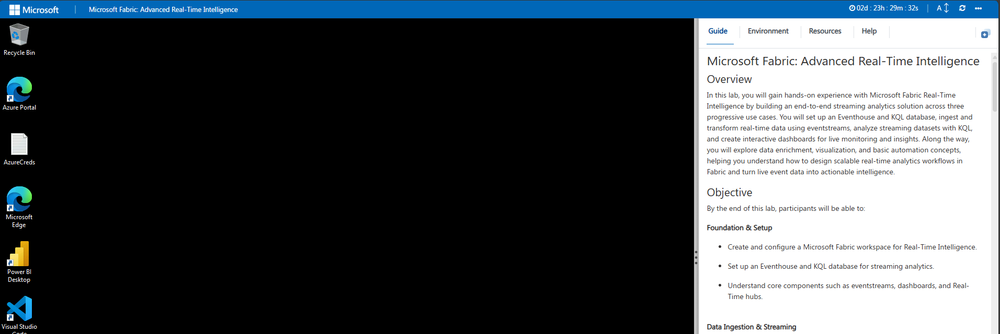
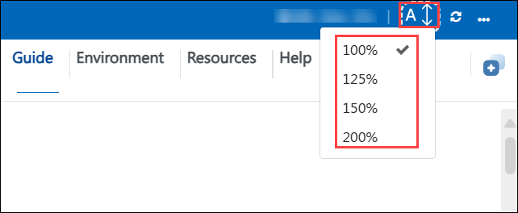
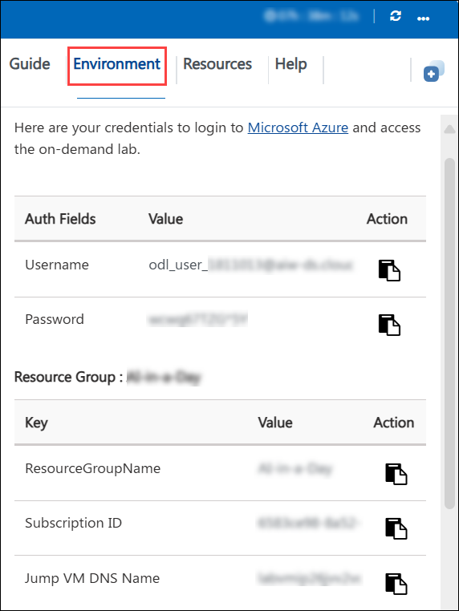
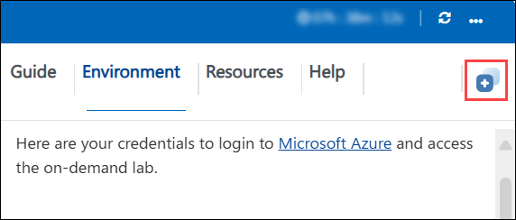
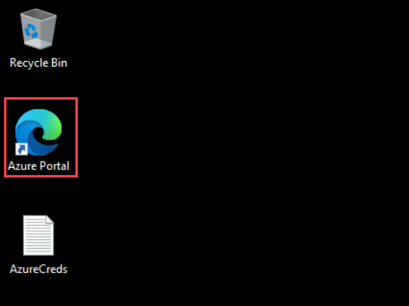
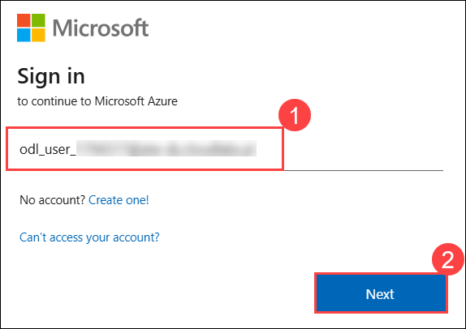
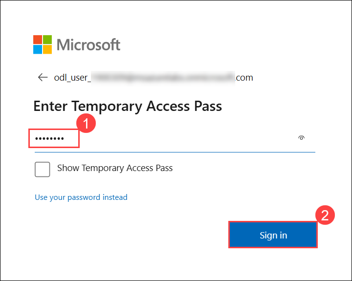
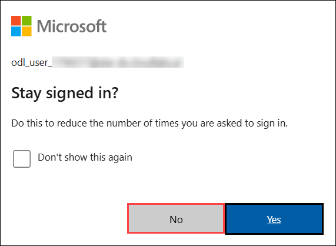
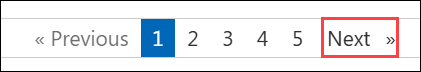

# Microsoft Fabric: Advanced Real-Time Intelligence​​

## Overview

In this lab, you will gain hands-on experience with Microsoft Fabric Real-Time Intelligence by building an end-to-end streaming analytics solution across three progressive use cases. You will set up an Eventhouse and KQL database, ingest and transform real-time data using eventstreams, analyze streaming datasets with KQL, and create interactive dashboards for live monitoring and insights. Along the way, you will explore data enrichment, visualization, and basic automation concepts, helping you understand how to design scalable real-time analytics workflows in Fabric and turn live event data into actionable intelligence.

## Objective

By the end of this lab, participants will be able to:

**Foundation & Setup**

 - Create and configure a Microsoft Fabric workspace for Real-Time Intelligence.

 - Set up an Eventhouse and KQL database for streaming analytics.

 - Understand core components such as eventstreams, dashboards, and Real-Time hubs.

**Data Ingestion & Streaming**

  - Build eventstreams to ingest real-time data from supported sources.
  
  - Configure data routing, filtering, and transformations within event pipelines.
  
  - Manage streaming data flow into KQL databases for analysis.

**Real-Time Analytics & Querying**

  - Write and execute Kusto Query Language (KQL) queries to analyze live data.
  
  - Perform aggregations, filtering, and time-based analysis on streaming datasets.
  
  - Explore Copilot-assisted querying and data exploration features.

**Visualization & Monitoring**

  - Create interactive real-time dashboards and visualizations.
  
  - Design tiles, charts, and filters for operational monitoring.
  
  - Track live metrics and analyze trends from streaming events.

**Automation & Operational Insights**

  - Implement basic alerting and monitoring concepts for real-time scenarios.
  
  - Understand how streaming analytics supports automated decision-making workflows.
  
  - Apply best practices for building scalable real-time intelligence solutions in Fabric.

## Architecture

In this lab, you will use Microsoft Fabric Real-Time Intelligence to ingest, process, analyze, and visualize streaming data through an end-to-end analytics workflow. The architecture begins by creating a Fabric workspace, Eventhouse, and KQL database to store and query real-time events. Data is ingested through eventstreams, where it can be filtered, transformed, and routed into the KQL database for live analysis. You will use Kusto Query Language (KQL) to explore streaming datasets and generate insights, then build interactive dashboards to monitor events in real time. Throughout the lab, you will observe how data flows from ingestion to visualization, enabling operational monitoring, near-real-time analytics, and data-driven decision-making within a unified Fabric environment.

## Explanation of Components

The architecture for this lab involves the following key components:

1. **Microsoft Fabric Workspace**: A unified environment where Real-Time Intelligence resources are created and managed.

   - Acts as the central hub for Eventhouse, eventstreams, dashboards, and analytics assets.

   - Provides governance, collaboration, and resource organization within Fabric.

2. **Eventhouse & KQL Database**: The core analytics engine used to store and query streaming data.

   - Serves as the backend for real-time analytics and monitoring.

   - Uses Kusto Query Language (KQL) to explore, filter, and aggregate incoming events.

   - Optimized for high-volume, low-latency data ingestion and querying.

3. **Eventstreams**: The ingestion and routing layer for real-time data.

   - Collects streaming events from supported sources and routes them into destinations like KQL databases.

   - Supports filtering, transformation, and enrichment before storage.

   - Enables near-real-time data pipelines within Fabric.

4. **Kusto Query Language (KQL)**: The primary query language used for analyzing streaming datasets.

    - Powers data exploration, aggregations, time-series analysis, and troubleshooting.
    
    - Used in dashboards, monitoring views, and advanced analytics scenarios.
    
    - Real-Time Dashboards & Visualizations: Interactive dashboards built on top of KQL queries.
    
    - Provide live monitoring with charts, tiles, and filters.
    
    - Help track trends, anomalies, and operational metrics from streaming data.

5. **Monitoring & Automation Concepts**: Real-time analytics enables proactive decision-making.

    - Supports alerting scenarios based on incoming event patterns.
    
    - Demonstrates how streaming insights can drive operational workflows and automated actions.
  
# Getting Started with Lab

  Once you are ready to dive in, your virtual machine and Guide will be right at your fingertips within your web browser.

  

## Lab Guide Zoom In/Zoom Out

  To adjust the zoom level for the environment page, click the A↕ : 100% icon located next to the timer in the lab environment.

  

## Virtual Machine & Lab Guide

  Your virtual machine is your workhorse throughout the workshop. The guide is your roadmap to success.

## Exploring Your Lab Resources

To get a better understanding of your lab resources and credentials, navigate to the Environment tab.
   
   

## Utilizing the Split Window Feature

For convenience, you can open the lab guide in a separate window by selecting the Split Window button from the top right corner.

  

## Managing Your Virtual Machine

Feel free to **start, restart, or stop** (2) your virtual machine as needed from the **Resources** (1) tab. Your experience is in your hands!

   

## Let's Get Started with Azure Portal

1. On your virtual machine, click on the **Azure Portal** icon.

   

1. On the Sign in to Microsoft Azure tab you will see the login screen, in that enter the following email/username, and click on **Next (2)**.

   - **Email/Username: (1)** <inject key="AzureAdUserEmail"></inject>

       

1. Now enter the following Temporary Access Pass and click on **Sign in (2)**.

   - **Temporary Access Pass: (1)** <inject key="AzureAdUserPassword"></inject>

        

1. If you see the pop-up Stay Signed in?, select **No**.

   

1. If you see the pop-up **You have free Azure Advisor recommendations!**, close the window to continue the lab.

1. If a **Welcome to Microsoft Azure** popup window appears, select **Maybe Later** to skip the tour.

## Support Contact

The CloudLabs support team is available 24/7, 365 days a year, via email and live chat to ensure seamless assistance at any time. We offer dedicated support channels tailored specifically for both learners and instructors, ensuring that all your needs are promptly and efficiently addressed.

Learner Support Contacts:

 - Email Support: cloudlabs-support@spektrasystems.com
 - Live Chat Support: https://cloudlabs.ai/labs-support

Click **Next >>** from the bottom right corner to embark on your Lab journey!
 
 

**Happy Learning!!**

  
