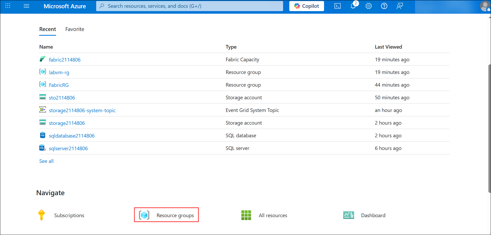
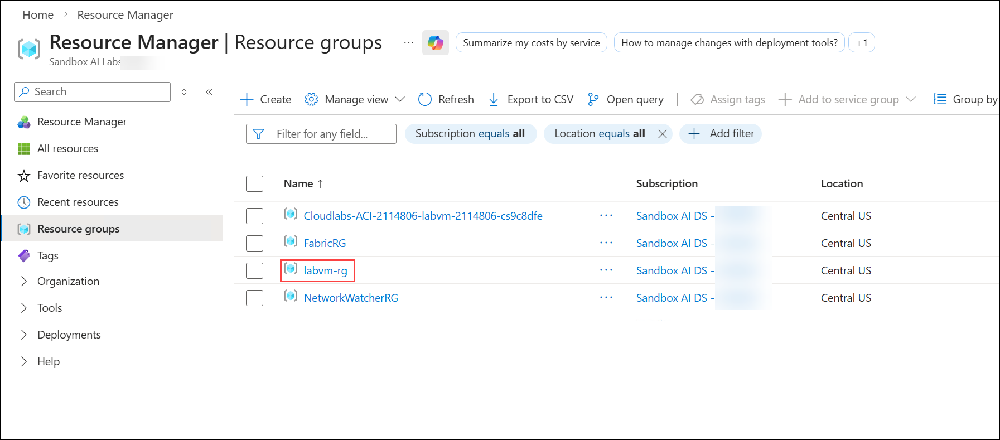
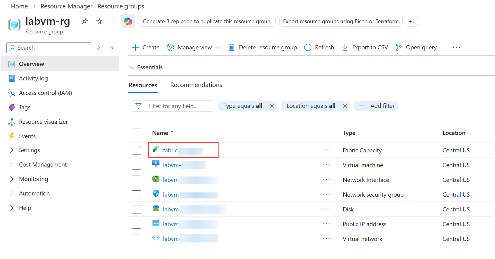
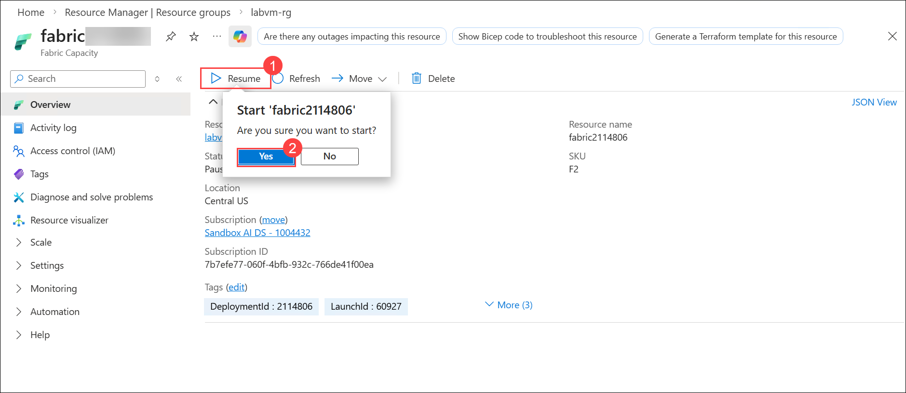
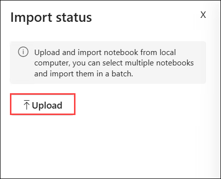
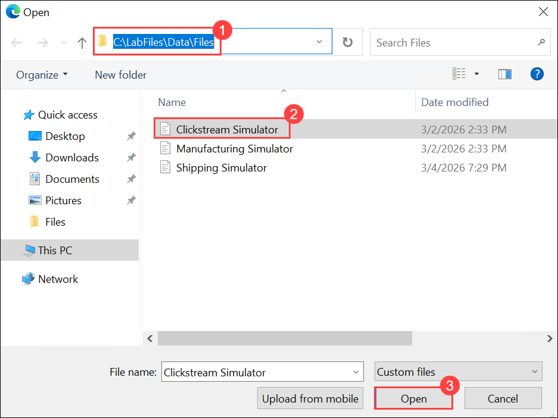
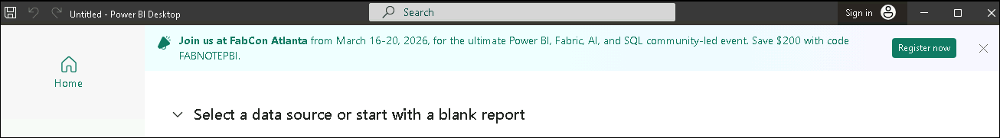
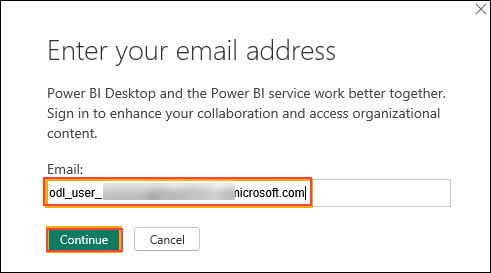
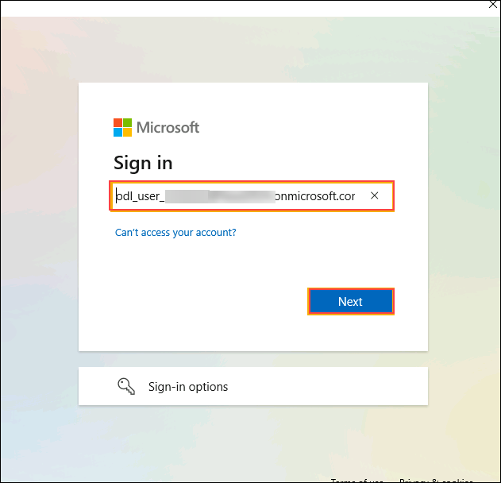
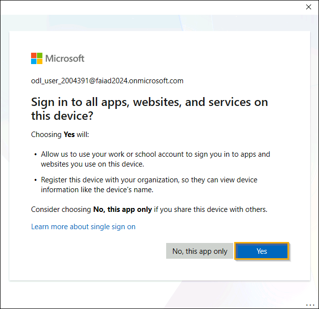

# Lab 3: Real-Time Product Clickstream Monitoring and Insights using Microsoft Fabric

**Introduction**

In this lab, you will extend Microsoft Fabric Real-Time Intelligence (RTI) to capture and analyze live product clickstream data from Fabrikam’s e-commerce platform. You will ingest streaming customer interaction events, process them using KQL queries, and generate insights that reveal product demand patterns as they occur.

By the end of this lab, you will be able to monitor real-time customer behavior, identify high-performing products, evaluate demand surges, and transform streaming engagement data into actionable business intelligence.

**Scenario: From Operational Stability to Customer Intelligence – Understanding Demand as It Happens**

After establishing real-time visibility across manufacturing, logistics, and shipment operations, Fabrikam has stabilized its operational ecosystem. However, leadership now faces a new strategic priority: understanding customer behavior in real time.

As digital traffic increases across web and mobile platforms, thousands of clickstream events are generated every minute — including product views, add-to-cart actions, purchases, referral sources, and device interactions.

Without real-time visibility into these events:

- Marketing teams cannot detect viral product trends early

- Pricing teams cannot assess demand elasticity instantly

- Inventory planners cannot anticipate stock pressure

- Leadership lacks immediate insight into traffic surges and revenue opportunities

To stay competitive, Fabrikam must capture live customer interactions and transform raw clickstream telemetry into real-time demand intelligence.

The organization now needs a streaming analytics solution that identifies top-performing products, evaluates cost and pricing impact, and uncovers growth opportunities across channels and devices — all in real time.

**Objectives**

In this lab, you will:

- Ingest real-time clickstream events using Eventstream and custom endpoints

- Stream clickstream data into Eventhouse for low-latency analytics

- Analyze customer behavior and product demand using Kusto Query Language (KQL)

- Identify top-demand products and evaluate pricing and cost impact in real time

- Detect growth opportunities based on referral platforms, devices, and traffic trends

- Operationalize insights using Dataflow Gen2, Pipelines, and scheduled updates

- Visualize real-time demand and engagement patterns using Power BI

- Enable AI-driven exploration of streaming data using a Fabric Data Agent

# Please follow these steps to Resume the Fabric.

- Navigate to the **Azure Portal**. from the **Home** page, click on **Resource groups** under the **Navigate** section.

    

- In the **Resource groups** page, locate and select the resource group **labvm-rg**.

    

- Inside the **labvm-rg** resource group, find and click on the **Fabric Capacity** resource named **fabric<inject key="DeploymentID" enableCopy="false" />**.

    

- On the **Overview** page of the Fabric Capacity resource, click **Resume** from the top menu. Click **Yes** to pause the Fabric Capacity resource.

    

# Exercise 1: Stream, Transform, and Analyze Clickstream Events

## Task 1: Set Up an Eventstream and Create Custom Endpoints

1.  Now, click on **RealTimeWorkspace<inject key="DeploymentID" enableCopy="false" />** on the left-sided navigation pane.

1.  In the Workspaces pane, select **+ New item**. In the **Filter by  item type** search box, enter **Eventstream** and select the **Eventstream** item

    

1.  Enter **clickstream_eventstream<inject key="DeploymentID" enableCopy="false" />** as the eventstream name and select **Create**. 

1.  On the Screen **Design a flow to ingest, transform, and route streaming events** click on **Use custom Endpoint**. This will create an event hub connected to the Eventstream.

    

1.  Insert **CustomEndpoint-clickstream** as the source name and click on **Add**.

    

1.  Click on the **Publish** button.

    

1.  On the **Eventstream** pane, select the **keys** under  the **Details**, select **SAS key Authentication ,** copy the **Event hub name**, **connection strings-primarykey** and paste  them on a notepad, as you need them in the upcoming task

    

1.  Now, click on **RealTimeWorkspace<inject key="DeploymentID" enableCopy="false" />** on the left-sided navigation  pane.

    

## Task 2: Import Clickstream Simulator data Notebook

1.  On the **RealTimeWorkspace** page, from the menu bar, navigate and click on **-\>|Import** (1) button, then select **Notebook** (2) and  select **From this computer** (3) as shown in the below image.

    

1.  Select **Upload** from the **Import status** pane that appears on  the right side of the screen.

    

1.  Navigate and select **Clickstream Simulator** notebooks from **C:\LabFiles\Data\Files**and click on the **Open** button.

    

1.  Then, select the **Clickstream Simulator**  notebook.

    

1.  To start the notebook, run the first cell.

    

1.  Run the second cell.

    

1.  In the  third cell paste the **connection string of your custom  app source and EventHubName** (the value that you have saved in your notepad in Task 1 step number 7, select the **Run** icon that appears on the left
    side of the cell

    

1.  Run the fourth cell.

    

1.  Run the subsequent cells

    

    

1. Now, click on **clickstream_eventstream** on the top navigation  pane.

   

1. In the event stream authoring canvas, select the **Edit**

   

1. Click on the node **Transform events or add Destination** and select **Eventhouse** from the menu.

   

1. Provide the following values in the pane **Eventhouse**. Click the button **Save** after you entered all the values.

    | Field                          | Value |
    |--------------------------------|-------|
    | Event processing before ingestion | Ensure that this option is selected (1) |
    | Destination Name               | Eventhouse (2)|
    | Workspace                      | Select **RealTimeWorkspace<inject key="DeploymentID" enableCopy="false" />** (3)|
    | Eventhouse                     | Select the Eventhouse **Eventhouse<inject key="DeploymentID" enableCopy="false" />** (4) |
    | KQL Database                   | Select the KQL Database **Eventhouse<inject key="DeploymentID" enableCopy="false" />** (5) |
    | Destination table              | Click **Create new**, enter **clickstream** as the table name, and click **Done**(6)|
    | Input data format              | Ensure that the **JSON** option is selected (7)|

    

1. Click on the button **Publish** that is located in the toolbar at the top of the screen.

   

   

   > **Note:**It will take 2 to 5 minutes to appear data in Data preview.

1. Now, click on **RealTimeWorkspace<inject key="DeploymentID" enableCopy="false" />** on the left-sided navigation pane. Select **Eventhouse<inject key="DeploymentID" enableCopy="false" />**

   

   

## Task 3: Knowledge of Kusto Query Language (KQL) to analyze the data.

1.  Now, click on **RealTimeWorkspace<inject key="DeploymentID" enableCopy="false" />** on the left-sided navigation pane and select **L400_KQL_Queryset**

    

1.  Create a new tab within the queryset by clicking on the **+** icon.

1.  In the query editor, paste the provided code to top 3 products by demand, then click **Run** to execute the query. After execution,the results will be displayed.
   
    ```
    //top 3 products by demand
    //summarize is similar to group by in sql
    clickstream
    | where event_type in ("purchase_completed", "add_to_cart", "product_click", "checkout_initiated")
    | summarize TotalDemand = count() by product_id
    | top 3 by TotalDemand desc
    | project TotalDemand, product_id
    ```

    

1.  Create a new tab within the queryset by clicking on the **+** icon

1.  In the query editor, paste the provided code to see the cost of those top 3 products, then click **Run** to execute the query. After execution, the results will be displayed.

    > **Note:** If you are not able to see the out put please make it as 40 instaed of 3 in the query.
   
    ```
    //let`s see the cost of those top 3 products
    clickstream
    | where event_type in ("purchase_completed", "add_to_cart", "product_click", "checkout_initiated")
    | summarize TotalDemand = count() by product_id
    | top 3 by TotalDemand desc
    | join products_silver on $left.product_id == $right.ProductId
    ```

    

1.  Create a new tab within the queryset by clicking on the ***+* icon**

1.  In the query editor, paste the provided code to create a copy of the  table products_silver to test out the cost increase, then click  **Run** to execute the query. After execution, the results will be
    displayed.

    > **Note:** If you are not able to see the out put please make it as 40 instaed of 3 in the query.
    
    ```
    //let`s create a copy of the table products_silver to test out the cost increase
    .create table product_copy (ProductId:string, ProductName:string, SKU:string, Brand:string, Category:string, UnitCost:int)
    ```

    

1.  Create a new tab within the queryset by clicking on the **+** icon.

1.  In the query editor, paste the provided code to recommended for one time load, now our table looks like the product table, then click  **Run** to execute the query. After execution, the results will be displayed.

    > **Note:** If you are not able to see the out put please make it as 40 instaed of 3 in the query.
   
    ```
    //recommended for one time load, now our table looks like the product table
    .set-or-replace product_copy <|
    products_silver
    ```

     

1. Create a new tab within the queryset by clicking on the ***+* icon**

1. In the query editor, paste the provided code, then click **Run** to  execute the query. After execution, the results will be displayed.

    > **Note:** If you are not able to see the out put please make it as 40 instaed of 3 in the query.
   
    ```
    //let`s also save the result of the TOP 3 products in another table, because we`ll need it in the update command, the let Delete or Append only accepts the table name you are modifying 
    .create table Top3Products (ProductId:string, ProductName:string, SKU:string, Brand:string, Category:string, UnitCost:int);
    ```

    

1. Create a new tab within the queryset by clicking on the **+** icon

1. In the query editor, copy and paste the following code. Click on   the **Run** button to execute the query. After the query is  executed, you will see the results.

    > **Note:** If you are not able to see the out put please make it as 40 instaed of 3 in the query.
   
    ```
    .set-or-replace Top3Products <|
    clickstream
    | where event_type in ("purchase_completed", "add_to_cart", "product_click", "checkout_initiated")
    | summarize TotalDemand = count() by product_id
    | top 3 by TotalDemand desc
    | join products_silver on $left.product_id == $right.ProductId
    | project ProductId, ProductName, SKU, Brand, Category, UnitCost;
    ```
    

1. In the query editor, copy and paste the following code. Click on the **Run** button to execute the query. After the query is executed, you will see the results.

    > **Note:** If you are not able to see the out put please make it as 40 instaed of 3 in the query.
   
    ```
    //to update we`ll use a .update command that uses append and delete
    .update table product_copy delete top3Products append Top3ProductsWithUpdatedCost <|
    let top3Products = product_copy
    | where ProductId in (Top3Products | project ProductId );
    let Top3ProductsWithUpdatedCost = product_copy
    | where ProductId in (Top3Products | project ProductId )
    | extend UnitCost = toint(UnitCost + UnitCost * 0.15);
    ```

    

1. Create a new tab within the queryset by clicking on the **+** icon.

1. In the query editor, copy and paste the following code. Click on the **Run** button to execute the query. After the query is executed, you will see the results.

    > **Note:** If you are not able to see the out put please make it as 40 instaed of 3 in the query.
   
    ```
    //great, now run again the query that finds out the Top 3 products, they aren`t the same right?
    // that is why we need to have a pipe
    //in the pipe we`ll create 1 KQL acitivity where we`ll update our top 3 products daily
    .set-or-replace Top3Products <|
    clickstream
    | where event_type in ("purchase_completed", "add_to_cart", "product_click", "checkout_initiated") and ingestion_time() > ago(1d)
    | summarize TotalDemand = count() by product_id
    | top 3 by TotalDemand desc
    | join products_silver on $left.product_id == $right.ProductId
    | project ProductId, ProductName, SKU, Brand, Category, UnitCost;
    ```

     

1. Create a new tab within the queryset by clicking on the **+** icon

1. In the query editor, copy and paste the following code. Click on the **Run** button to execute the query. After the query is executed, you will see the results.

    > **Note:** If you are not able to see the out put please make it as 40 instaed of 3 in the query.
   
    ```
    //the 2nd KQL activity will update the products table with the cost increased by 15% for the most demanded products
    .update table product_copy delete top3Products append Top3ProductsWithUpdatedCost <|
    let top3Products = product_copy
    | where ProductId in (Top3Products | project ProductId );
    let Top3ProductsWithUpdatedCost = product_copy
    | where ProductId in (Top3Products | project ProductId )
    | extend UnitCost = toint(UnitCost + UnitCost * 0.15);
    ```    

     

## Task 4: Create a Growth Opportunity Report

1.  Create a new tab within the queryset by clicking on the ***+* icon**

1.  In the query editor, paste the provided code to get demand product, then click **Run** to execute the query. After execution, the results will be displayed.

    > **Note:** If you are not able to see the out put please make it as 40 instaed of 3 in the query.
   
    ```
    //in demand product
    clickstream
    | where event_type in ("purchase_completed", "add_to_cart", "product_click", "checkout_initiated")
    | summarize TotalDemand = count() by product_id
    | top 1 by TotalDemand desc
    | join products_silver on $left.product_id == $right.ProductId
    | project ProductName
    ```

    

1.  Create a new tab within the queryset by clicking on the **+** icon

1.  In the query editor, copy and paste the following code. Click on the **Run** button to execute the query. After the query is  executed, you will see the results.

    > **Note:** If you are not able to see the out put please make it as 40 instaed of 3 in the query.
   
    ```
    //website with highest traffic
    //you mean referral platform
    clickstream
    | where event_type in ("purchase_completed", "add_to_cart", "product_click", "checkout_initiated") and isnotempty(referral_platform) 
    | summarize TotalDemand = count() by referral_platform
    | top 1 by TotalDemand desc
    ```
     

1.  Create a new tab within the queryset by clicking on the **+** icon

1.  In the query editor, copy and paste the following code. Click on the **Run** button to execute the query. After the query is  executed, you will see the results.

    > **Note:** If you are not able to see the out put please make it as 40 instaed of 3 in the query.
   
    ```
    // product clicks over time
    clickstream
    | where event_type == "product_click"
    | extend EventTime = todatetime(timestamp)
    | extend ClickTime = bin(EventTime, 1h)
    | summarize NumberOfClicks = count() by product_id, ClickTime
    | order by ClickTime asc
    ```

    

1.  Create a new tab within the queryset by clicking on the ***+* icon**

1.  In the query editor, copy and paste the following code. Click on  the **Run** button to execute the query. After the query is executed, you will see the results.

    > **Note:** If you are not able to see the out put please make it as 40 instaed of 3 in the query.
   
    ```
    //product clicks over time 
    clickstream
    | where event_type in ("product_click")
    | extend ClickTime = bin(todatetime(timestamp), 1h)
    | summarize NumberOfClicks = count() by product_id, ClickTime
    | order by ClickTime asc
    ```

    

1.  Create a new tab within the queryset by clicking on the **+** icon

1. In the query editor, copy and paste the following code. Click on the **Run** button to execute the query. After the query is  executed, you will see the results.

    > **Note:** If you are not able to see the out put please make it as 40 instaed of 3 in the query.
   
    ```
    //website traffic distribution
    clickstream
    | where isnotempty(referral_platform) 
    | summarize Websites = count() by referral_platform
    ```
    

1. Create a new tab within the queryset by clicking on the ***+* icon**

1. In the query editor, copy and paste the following code. Click on the **Run** button to execute the query. After the query is executed, you will see the results.

    > **Note:** If you are not able to see the out put please make it as 40 instaed of 3 in the query.
   
    ```
    //device traffic distribution
    clickstream
    | where isnotempty(referral_source_type) 
    | summarize Traffic = count() by referral_source_type
    ```

    

1. Create a new tab within the queryset by clicking on the **+** icon

1. In the query editor, copy and paste the following code. Click on the **Run** button to execute the query. After the query is  executed, you will see the results.

    > **Note:** If you are not able to see the out put please make it as 40 instaed of 3 in the query.
   
    ```
    //forecast the temperature
    manufacturing
    | extend timestamp = todatetime(timestamp) 
    | where DefectProbability == "Anomaly"
    // Creates a time series of average temperature values, grouped into 1-hour intervals over the past 1 day
    | make-series avg_temp=avg(Temperature) on timestamp from ago(3d) to now() step 6m 
    // Applies anomaly detection to the temperature series, 7h
    | extend forecast = series_decompose_forecast(avg_temp,48) 
    | render timechart 
    ```

## Task 5: Create Dataflow Gen2

1.  Now, click on **RealTimeWorkspace<inject key="DeploymentID" enableCopy="false" />** on the left-sided navigation
    pane.

1.  In the Workspaces pane, select **+ New item** and select the **Dataflow Gen2**.

     

1.  Enter **RTI_Dataflow** as the new Dataflow Gen2 name and select **Create**. 

    

1.  From the **Home** tab, select **Get data** and then click on the **More...** option to upload the tables into Dataflow Gen2

    

 1. Select the KQL Database and click on **Connect**   

    

1.  Select clickstream table and click **Create**

    

1. Click on **Diagram View** in the bottom right corner of the window to change the view.

    

1.  On the Home window, select **Save & run** and click on **Save & run** button

     

     

1.  Now, click on **RealTimeWorkspace<inject key="DeploymentID" enableCopy="false" />** on the left-sided navigation
    pane.

1.  Select the **New item** option on the workspace page. Select **Pipeline** from the new item flyout menu.

     

1.  Provide a Pipeline Name as **datafactory_pipeline** and then select **Create**.

     

1.  Select Dataflow

    

1.  Select workspace and dataflow

    

1. On the **Home** tab of the pipeline editor window, select the **Run** button to manually trigger the run of the pipeline.

    

1. On the **Save and run?** dialog box, select **Save and run** to execute these activities. This activity will take around 1-2 min.

    

    

1. On the **Home** tab of the pipeline editor window,select **Schedule**.

   

1. Select **+ Add schedule** and configure the schedule as required. 

   

1. Select the **Daily** as schedule and click on **Save** button and close the Schedule pane

   

   

1. Now, click on **RealTimeWorkspace<inject key="DeploymentID" enableCopy="false" />** on the left-sided navigation pane.

## Task 6: Create a “Growth Opportunity” Report

1.  Open  PowerBI desktop from the desktop screen.

     

1. In the PowerBi desktop window click on **Sign in**

    

1. Once the "Enter your email address" dialog appears, copy the Username and paste it into the Email field of the dialog and select Continue.

    **Email/Username**: <inject key="AzureAdUserEmail"></inject>

     

1. On the Sign into Microsoft Azure tab, you will see the login screen,enter the following Email/ Username and then click on **Next**.

    

1. Now enter the following Temporary Access Pass and click on Sign in.

   **Temporary Access Pass**: <inject key="AzureAdUserPassword"></inject>

    

1. Stay **Signed** in to all your apps dialog opens. Select **Yes**.

    

1. Account added to this Device Dialog opens. Select **Done**.

1.  In Power BI Desktop, select **OneLake catalog** to connect to data stored in Microsoft Fabric and start building your report.

    

1.  From the **OneLake catalog**, select **Eventhouse<inject key="DeploymentID" enableCopy="false" />** and click **Connect** to load the real-time data source into Power BI Desktop.

    

1.  In the **Sign in** window, click on the **<inject key="AzureAdUserEmail"></inject>** and click on the **Next** button.

1.  Select all the tables and click **Load** to import the data into Power BI Desktop.

    

1.  In the **Connection settings** dialog, select **Import** as the connection mode and click **OK** to proceed.

    

    

1. From the **Insert** tab in Power BI Desktop, select **Text box** to  add descriptive text or titles to your report canvas.

    

1. Type in **Growth Opportunity Report**. **Highlight** the **text** and increase size to **32**.

    

1. Select the **Slicer** visual, then drag **ProductName** from the **products_silver** table into the **Field** well to enable product-based filtering in the report.

    

1. In the **Visualizations** pane, open **Format visual**, go to **Visual → Slicer settings**, and set the **Style** to **Dropdown**.

    

1. From the **Insert** tab, select **Text box**, then enter and format the text to display the selected product name as **Classic Wear Hoodies** and highlight it as the **Top Demand Product** in the
    report.

    

1. Select the **Pie chart** visual, then drag **referral_platform** to the **Legend** and **event_id** to **Values (Count)** from the **clickstream** table to visualize event distribution by referral
    platform.

    

1. From the **Insert** tab, select **Text box**, then enter and format the text to display the selected product name as **Pinterest** and highlight it as the **Platform that generates most traffic** in the
    report.

    

1. Select the **Pie chart** visual, then drag **referral_source_type**  to the **Legend** and **Count of event_id** to **Values (Count)** from the **clickstream** table to visualize event
    distribution by referral source type.

   

   

1. In the Power BI report, select **Save As** to create a copy or save the report with a new name

   

   

## Task 7: Setup Data Agent with Real-Time Intelligence

1.  Back in  the **Fabric** **RealTimeWorkspace<inject key="DeploymentID" enableCopy="false" />** page in the browser window, select **+New item.** **In the Filter by item type search box, enter +++data agent+++ and select the Data agent**

    

1.  Enter **l400-agent** as the Data agent name and select **Create**.

    

1.  In AI-agent page, select **Add a data source**

    

1.  In the **OneLake catalog** tab, select the **Eventhouse<inject key="DeploymentID" enableCopy="false" />** and select **Add**.

    

    

1.  Select the tables for which you want the AI skill to have available access
        
        - product_copy
        
        - product_silver
        
        - Top 3 products

        - shipping_silver

1.  Enter the following text and click on the **Submit icon** as shown  in the below image.

    ```
    What is the most popular product?
    ```
    

    


1.  Select **clickstream** and enter the following text and click on the **Submit icon** as shown in the below image.

    ```
    Which website redirected the highest traffic?
    ```
    

    

**Summary**
>
This lab builds upon Fabrikam’s real-time operational intelligence foundation by adding customer clickstream analytics to the solution. Using Microsoft Fabric, real-time user interactions from the e-commerce platform are streamed, analyzed, and correlated with product data to reveal demand patterns and revenue opportunities as they emerge.
Participants implement end-to-end streaming ingestion, perform advanced KQL analytics, automate daily updates, and create interactive Power BI reports that highlight top products, traffic sources, and engagement trends. The lab concludes by enabling AI-powered data exploration, allowing business users to ask natural language questions against live data.
Together, these capabilities help Fabrikam move from reactive reporting to real-time, customer-driven decision-making, ensuring faster responses to market demand and sustained competitive advantage.


